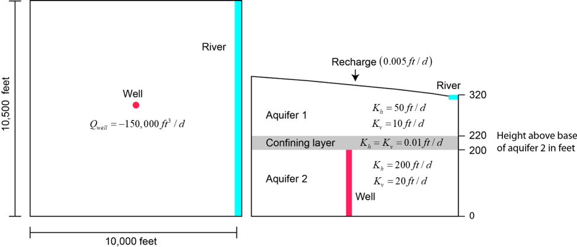
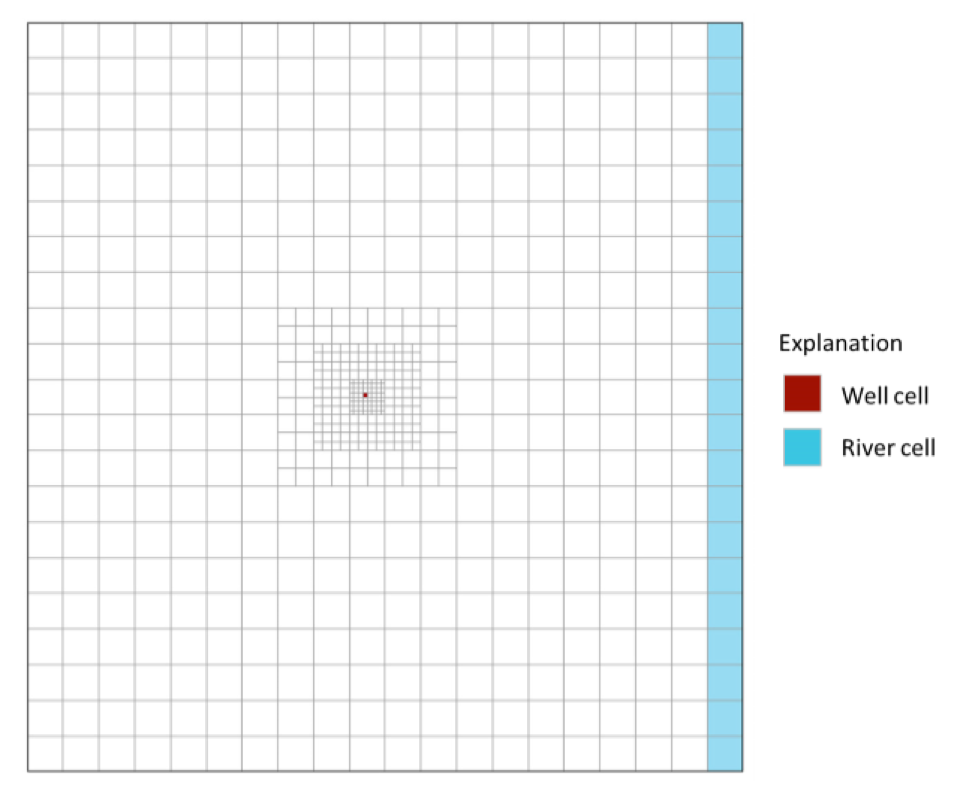
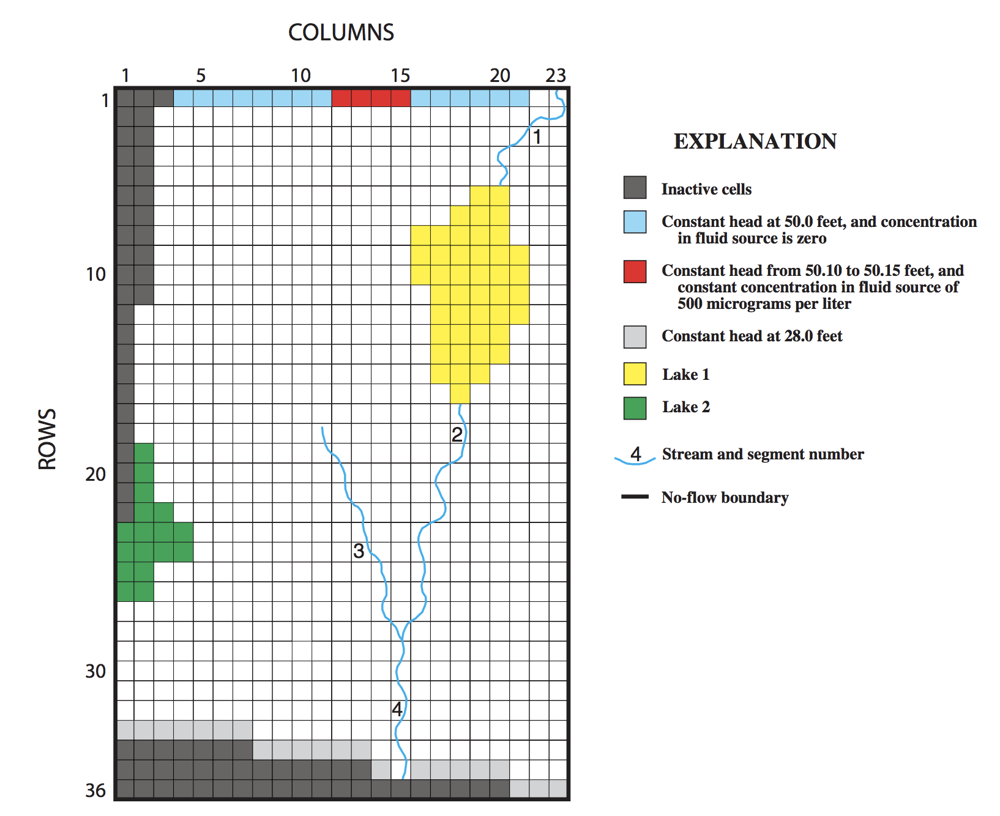

# MODFLOW 6 EXERCISES

## EXERCISE 1
Example 1 is based on the groundwater flow system shown below. The flow system consists of two aquifers separated by a thin low conductivity confining layer.

The system is simulated with a traditional structured model grid consisting of 3 model layers, 21 rows, and 20 columns (figure 2). Areal grid cells are uniform square cells, 500 feet per side. The model layers correspond to the hydrogeologic units shown in the figure above.

The well is located in row 11, column 10, and layer 3. The river is located in layer 1, column 20, rows 1 - 21.  The river conductance is 100,000 ft squared per day.  The river stage is 320. ft and the river bottom is at 318 ft.

The purpose of this problem is to become familiar with the MODFLOW 6 input files by creating the files by hand for Example Problem 1.  This requires creating the following files: mfsim.nam, ex02.tdis, ex02.ims, ex02.nam, ex02.dis, ex02.npf, ex02.ic, ex02.wel, ex02.riv, ex02.rch, ex02.oc.

Concepts to focus on for this exercise:
1. Simulation Name File (mfsim.nam)
2. Discretization (DIS) Package
    * Regular MODFLOW grid with layers, rows, and columns
    * Input file structure
    * LAYERED Keyword
3. Node Property Flow (NPF) Package
4. Boundary Packages
    * WEL, RIV, RCH
    * Become familiar with the BEGIN PERIOD iper block
    * Understand the READASARRAYS options for the RCH Package (and EVT) Package
5. Solver Package (IMS)
6. Output Control Package (OC)
7. Output Files
    * mfsim.lst, gwf.lst, ex02.dis.grb, ex02.hds, ex02.cbc

The sequence of steps are
1. Create the input files
2. Run the model
3. View the results with Model Viewer
4. Load and plot the model in a jupyter notebook using Flopy
5. Learn to use the OPEN/CLOSE keyword to enter a spatially variable hydraulic conductivity array
6. Split the RIV Package into two packages

## EXERCISE 2

The purpose of this exercise is to learn how to use Flopy to create MODFLOW 6 models.  We will create the same model as in the first exercise, except we will construct the model in a jupyter notebook.

The sequence of steps are
1. Use flopy to create the input files
2. Run the model
3. Plot the model results

## EXERCISE 3

The purpose of this exercise is to introduce the Discretization by Vertices (DISV) Package.  In this exercise, we will again create the same model as before except we will construct the grid using cell vertices and a cell definition list.

The sequence of steps are
1. Define the problem parameters
2. Define VERTICES and CELL2D
3. Create the flopy MODFLOW 6 model
4. Load the binary grid file, head, and budget file

## EXERCISE 4

Exercise 4 simulates the same groundwater flow system as in the first exercise except an unstructured grid is used to refine the area near the well. The figure below shows the unstructured grid, which is based on the structured grid used in example 1 (referred to as the base grid). The areal grid is refined around the base-grid location that contains the well in example 1 (row 11, column 10). The base-grid cell containing the well is refined three levels, which means that the unstructured grid contains an 8 x 8 array of 64 cells in place of the original base-grid cell. The grid is smoothed so that it will meet the requirements of MODPATH for unstructured grids. The same areal grid is used for all model layers. The three-layer unstructured grid contains a total of 1,953 cells. The well is located in layer 3 near the center of the cell containing the base-grid well.

In this exercise we will use the GRIDGEN program to create the quadtree grid.

## EXERCISE 5

The purpose of this exercise is to demonstrate the use of multiple Groundwater Flow (GWF) models to simulate Example Problem 1.

## EXERCISE 6

The purpose of this exercise is to add observations to an existing MODFLOW 6 model using FloPy and plot the results. The model is based on test simulation 2 in [Prudic and others (2004)](https://water.usgs.gov/nrp/gwsoftware/modflow2000/ofr2004-1042.pdf) and is meant to represent  a sand and gravel aquifer in Cape Cod, Massachusetts.

The aquifer is moderately permeable and is assumed to have homogeneous properties and uniform thickness. The aquifer was discretized into 8 layers (each 15 ft thick), 36 rows (at equal spacing of 405.7 ft), and 23 columns (at equal spacing of 403.7 ft). The model has 2 stress periods. The first stress period has a length of 1 day and is steady-state. The second stress period has a length of 5,000 days, is transient, and has 50 equal length time steps (100 day time step length).

The first and second stress periods have a recharge rate of 0.00479000 and 0.00526900 ft/day, respectively. Two lakes are located within the model domain and are represented as constant heads. The eastern lake (lake 1) is connected to a stream. Both lakes only occupy cells within the first model layer; this enables horizontal leakage between the lakes and adjacent active aquifer cells in layer 1 and vertical leakage between the lakes and underlying active aquifer cells in layer 2. Streams are connected to model layer 1 and represented as river (RIV) package cells.

The boundary conditions were designed to produce flow that is generally from north to south. For the numerical model, constant-head conditions were specified along the northern and southern edges of the model domain, and no-flow boundaries were set along the east and west edges of the grid.

## EXERCISE 7

The purpose of this exercise is to load a model that uses constant head cells to represent lakes and the River Package to represent streams, and modify the model to use the LAK and SFR Packages and have water transferred between them using the Water Mover (MVR) Package.

## EXERCISE 8

The purpose of this exercise is to load an existing model with SFR and LAK packages, and add a MVR package to transfer water between the SFR and LAK packages. We will also convert the SFR inflows to use a time series file and add LAK and SFR observations. The model is the same as the model used in exercise 7.

If there is time we may create the SFR and LAK packages from raw data contained in ascii files instead of reading an existing model with these packages.
